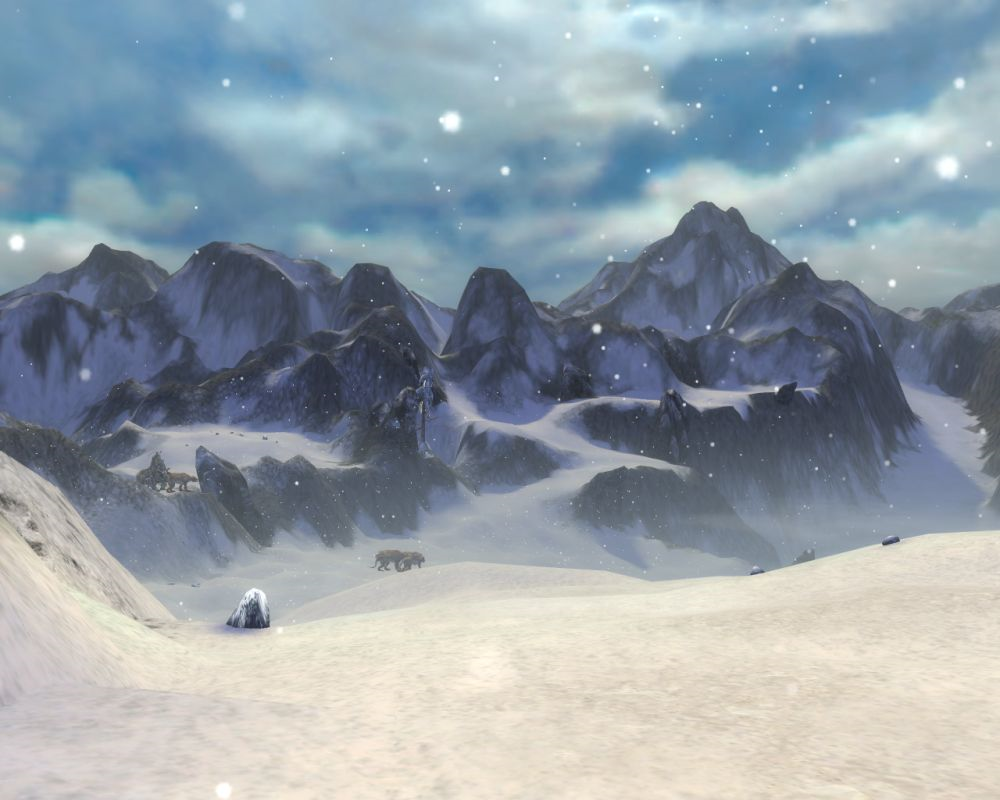
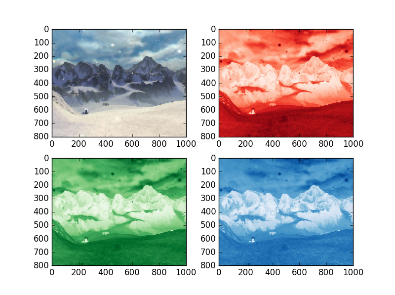

UECM3033 Assignment #2 Report
========================================================

- Prepared by: Chai Kun Ting
- Tutorial Group: T3

--------------------------------------------------------

## Task 1 --  $LU$ Factorization or SOR method

The reports, codes and supporting documents are uploaded to Github at: 

[https://github.com/chaikt12/UECM3033_assign2](https://github.com/your_github_id/UECM3033_assign2)

### Selection criteria ( LU or SOR )

### Implementation for `task1.py`

---------------------------------------------------------

## Task 2 -- SVD method and image compression

## Zero elements in $\Sigma$
Q: How many non zero element in $\Sigma$?
A: All elements in $\Sigma$ are non zero elements

### Generating pictures from `task2.py`

1. First, we need to read the SnakeDance.jpeg into img where it contain 3 matrixs, which is r,g and b. Each r,g and b is a 3 dimensions matrix. We further decomposes each matrixs it into U, $\Sigma$ and  V, which is r1,r2 and r3 for the original red by using linalg.svd. Repeat the process for green and blue, namely g and b.

2.  Then, Create a new matrix $\Sigma_{30}$ which is the same dimensions as $\Sigma$, but keeping the first 30 none zero elements as in $\Sigma$, and set all other none zero elements to zero. this can be done by setting r2[30:800]=np.zeros_like(r2[30:800]). Repeat it with green and blue $\Sigma$.

3.  Next, we need to combine it back by dot multiplication of the U, $\Sigma_{30}$, V. But before this, we need to make the dimension of $\Sigma_{30}$ into (800,1000) so that it no dimensional error occur during the process. Noted that the $\Sigma_{30}$ is (800,1) originally. This can be done by r2 = linalg.diagsvd(r2,800,1000). Repeat it with green and blue $\Sigma_{30}$.

4. Now, the three newly generated matrix can be combined into a new r,g and b, namely as r_new, g_new, and b_new in the code. Put it back into img respectively.

5. Finally we can plot all the lower resolution matrix.

   In the code task2, two groups of 4 pictures will be plotted. Each group contain the original color type, red, green and blue. The first group of picture is the original set, while the second group is the lower resolution pictures.

# What is a sparse matrix?
Sparse matrix is a matrix which most of the element is zero. In our case, after we keep the first 30 non zero elements and set other elements to be zero, we change the dimension of the sigma from (800,1) to (800,1000) which created a sparse matrix of (800,1000) dimension matrix. This matrix is used for dot multiplication as mention above. Because the sparse matrix most elements is zero, this eventually help to make the lower resolutuon pictures.

-----------------------------------

last modified: 10/3/2016
